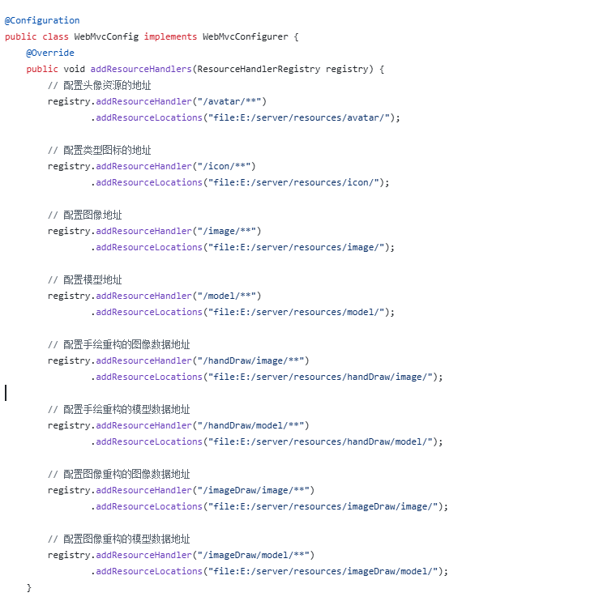
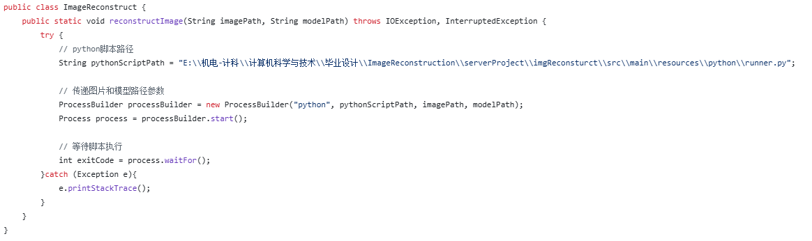
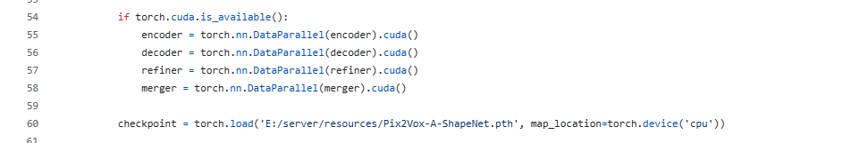
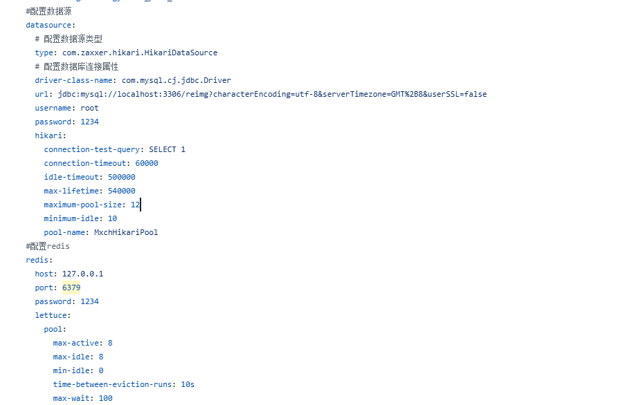

# 基于深度学习的三维重建系统——后端

## 项目介绍

该项目旨在构建一个基于深度学习的图像三维重建平台，实现从二维图像到三维模型的自动重建。用户可通过鼠标手绘图像或上传图片两种方式输入数据，系统后台通过部署的深度学习模型完成三维重建，并支持三维模型在线可视化、用户账户管理与社区互动交流等功能，打造一个集易用性与功能性于一体的综合性平台。

本系统按照前后端分离思想来开发，该项目为系统的后端项目。

## 项目技术栈（后端）

1. Spring Boot
2. Spring Security
3. MyBatis
4. MySQL
5. Redis
6. WebSocket
7. ...

## 配置信息

本系统采用本地存储数据，如头像、类型图标、图像和模型等数据地址信息，根据自己需要修改config文件夹下的WebMvcConfig.java中的内容。

配置服务器中的python编码器的位置信息，用于运行深度学习模型，根据自己所需修改util文件夹下的ImageReconstruct.java中的配置信息。

深度学习模型的权重文件的位置信息在resources中的runner.py文件中，根据自己需求进行修改。

根据本机配置情况修改mysql、redis等组件的配置信息，信息写于resources中的application.yaml文件中。

数据库文件为reimg.sql

## 深度学习模型

系统中实现二维图像到三维模型的重建所采用的模型是https://github.com/hzxie/Pix2Vox.git。

所用的模型权重文件是https://github.com/hzxie/Pix2Vox.git资源中的[Pix2Vox-A](https://gateway.infinitescript.com/?fileName=Pix2Vox-A-ShapeNet.pth)权重文件。